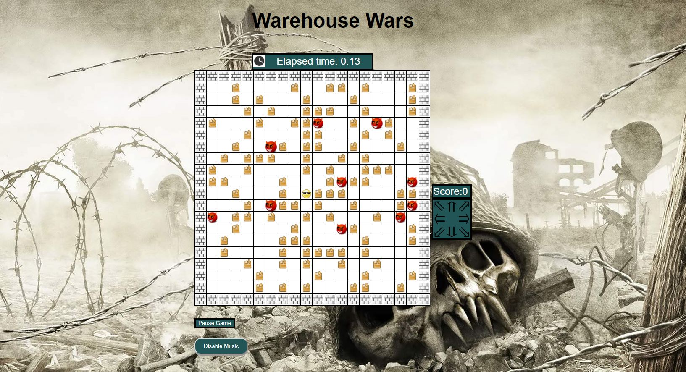

# Warehouse-War
Single web page based game called Warehouse Wars was built by Html, JavaScript, JQuery, Node.js, Express.js, MongoDB

## Demo


### Prerequisites

If you do not want to clone the node modules, type:

```
npm install
# Also install mongoDB
npm install mongodb

```

End with an example of getting some data out of the system or using it for a little demo


## Built With

* [HTML](https://developer.mozilla.org/kab/docs/Web/HTML)
* [CSS](https://developer.mozilla.org/kab/docs/Web/CSS)
* [NodeJS](https://nodejs.org)
* [ExpressJS](https://expressjs.com)
* [MongoDB](https://www.mongodb.com)


## Authors

* **David Li** - *Initial work* - [LYSingD](https://github.com/LYSingD)
